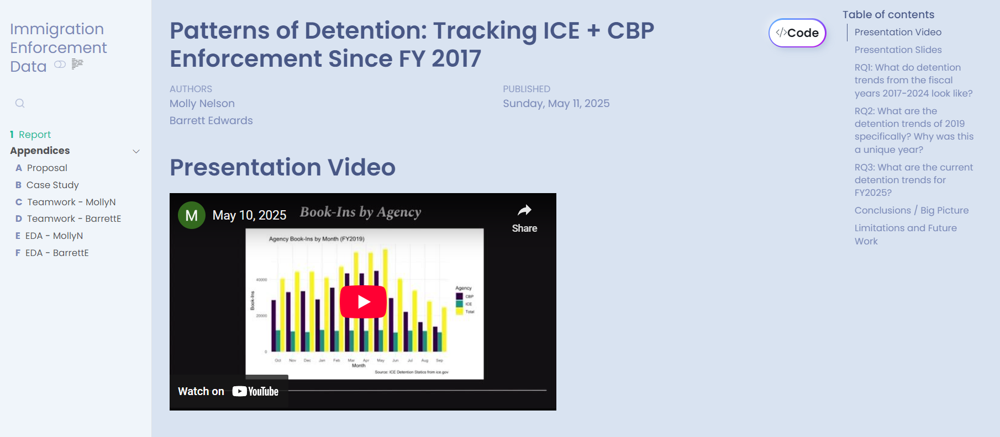

# Final Project (Barrett Edwards and Molly Nelson) 

# What is this GitHub repository is all about?

This repository contains an analysis of arrest data from U.S. immigration enforcement agencies, specifically Immigration and Customs Enforcement (ICE) and Customs and Border Protection (CBP), covering fiscal years 2017 through April 2025. It was developed as part of Macalester College's COMP/STAT 112: Introduction to Data Science course.

The goal of this project is to demonstrate our mastery of course learning objectives by working as a team to explore a self-formulated research question using a relevant dataset. This project highlights our ability to conduct data analysis, draw meaningful conclusions, and communicate insights effectively.

# What software (with the version numbers) need to be installed to run the code contained in this GitHub repository, eg, R version 4.4.3+ and RStudio 2024.12.1 Build 563?

To run this code, make sure the following software is installed:

- R version 4.4.3 or later
- RStudio 2024.12.1 Build 563 or later

Additionally, the following R packages must be installed: 
  - readr 
  - dplyr 
  - ggplot2 
  - tidyverse 
  - viridis 
  - scales 
  - ggrepel 
  - sf 
  - gplots 
  - maps
  - RColorBrewer 
  - mosaic
  - leaflet
  - tidyr
    
You can install them in R using: 

install.packages(c("readr", "dplyr", "ggplot2", "tidyverse", "viridis", "scales", 
                   "ggrepel", "sf", "gplots", "maps", "RColorBrewer", 
                   "mosaic", "leaflet", "tidyr"))

# What steps need to be taken to run the code contained in this GitHub repository? Think about the steps you did at the beginning of the semester to prepare your machine for class.

To run this project, you’ll need to have Git, R, and RStudio Desktop installed on your computer.
1. Install/Update Git
- If you are on a Microsoft Windows machine, install git from https://git-scm.com/downloads.
- If you are on an Apple macOS machine, launch the Terminal, then type git --version and hit enter.  If the terminal does not return an error message, you are all set.  If you were prompted to install XCode, say yes and follow the instructions–this will take a while.  Otherwise, install git from git-scm.com/downloads.

2. Install/Update R and RStudio Desktop:
- Install R (version 4.4.3 or later): https://cran.r-project.org/
- Install the latest version of RStudio Desktop from https://posit.co/download/rstudio-desktop/

3. Clone the repository:
- Visit the GitHub repo: https://github.com/manelson024/project-team-awesomest
- Click the green "Code" button and select "Open with GitHub Desktop".
- Choose a local path on your computer, then click "Clone".
- Select "For my own purposes", then click "Continue".
- In GitHub Desktop, go to the Repository menu and select "Show in Finder" (macOS) or "Show in Explorer" (Windows).
- Double-click the .Rproj file to open the project in RStudio.

# What is the expected output look like? 

